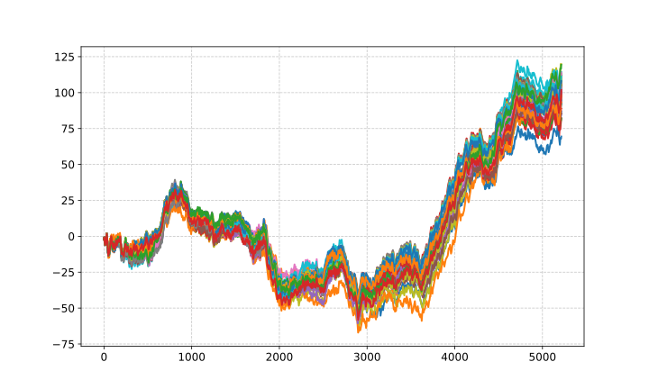
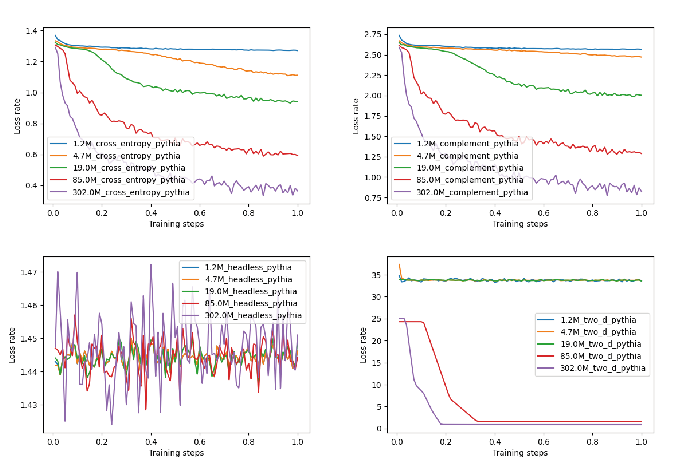
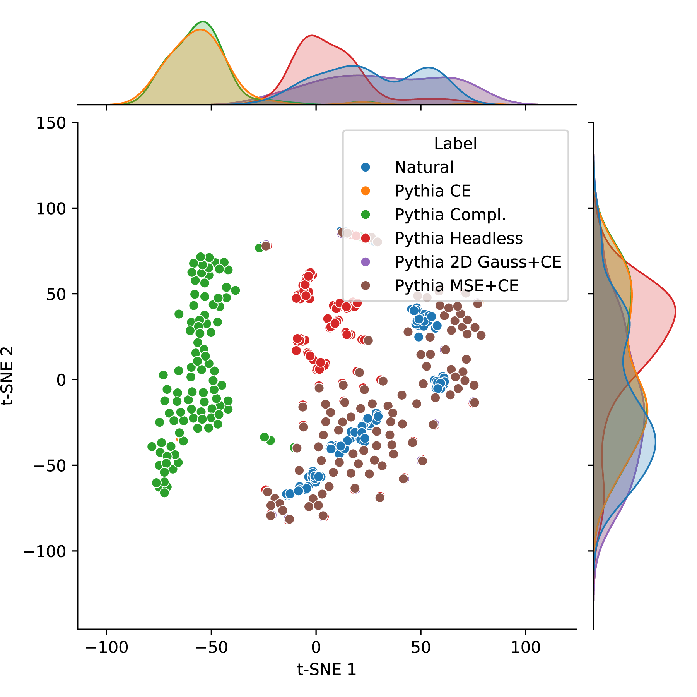

# nucleotide-model-experiments <!-- omit in toc -->

- [Abstract](#abstract)
- [Project Objectives and downstream plan](#project-objectives-and-downstream-plan)
  - [Workflow Modeling](#workflow-modeling)
  - [Workflow Datasets](#workflow-datasets)
- [Prior Work](#prior-work)
- [Datasets](#datasets)

## Abstract

Recent years have seen a flurry of generative nucleotide models, still mostly of limited utility. In this short paper, we extend the theoretical unification of ecological and evolutionary change by [Duthie \& Luque](https://arxiv.org/abs/2409.10766) to the the problem of synthetic DNA models. Through this extension, we provide, from first principles, methods for training improved models, grouping species as well as creating a road map to scale. 

## Authors and contributors
The original repo was a private branch hosted on Hassan's account which had orginals contributors contributions, so please be aware this repo is not a true representation whos done the work. 

Contributers: 
- Hassan Ahmed Hassan
- Kyle Puhger
- Ali Saadat
- Alexander Chen
- Maximilian Sprang

## Project Objectives and downstream plan

By exploring these work packages... 
1. **Ideal Loss:** What's the ideal loss function for a nucleotide model? What are the trade-offs with regard to each model type in this context? What do we lose, and what do we gain, information-wise? What sections of a sequence do each of the losses emphasize? Can we combine different losses? The losses in our experiments include but are not limited to Cross Entropy, Reverse Complements, Chaos Game Representation, Persistent Homology, Headless Loss, and 2D Line. See: [“Can we learn to generate viral genomes?”](https://huggingface.co/spaces/Hack90/virus_explorer)  for chart representation of those metrics.
2. **Ideal Model Architecture:** As mentioned above, we are interested in testing different models in multiple combinations with our losses. So, the questions above will apply to the different architectures, too. Model types we plan to use include Transformer-based, SSM-based, and mixed Models, as well as convolution-based models such as the Multiresolution Convolutional memory model (MultiresConv).
3. **Ideal Dataset:** How much redundancy is there in a genome dataset? What is the optimum learning strategy? How well is topology preserved between different samples and species?
4. **Maximum Scale, optimal parameters:** How do each of the previous steps change with scale? Are there clear scaling laws, and can these be applied to get an optimal large foundation model?

...This project aims to:

- Create a DNA-sequence:natural-language-description dataset of diverse species combining publicly available sequences with their associated texts/research papers.
- Build homologicaly/topologically optimised DNA models that outperform the current state of the art
- Build DNA models capable of generating biologically viable whole genomes

Potential downstream applications for Nucleotide-only Language Models (LLMs) include:

- Encoders for sequence comparisons and classifications
- Base models for fine-tuned sequence generators and predictors, such as:
  - DNA sequence risk scoring
  - Bacteria specific phage generators
  - Whole genome generators for de novo organisms
  - Antibiotic resistance classifiers based on bacterial plasmid DNA
- Sequence quality predictors for both small sequences (as found in functional genomics) and large sequences (as found in whole-genome sequencing projects)

## First results 

### 2D representations of viral genomes visualizes the function space a viral family occupies. 

**Figure 1.** All samples of the Norwalk-virus species available in our dataset as of 2024. There is a clear pattern that can be opbserved for all sequences, it deteriorates towards the end, as to the cumulative nature of this representation. 

### A loss based on 2D-representation works and converges similar to classical losses such as CE. 

**Figure 2.** Exemplary runs of the Transformer Architecture Model Pythia. Model parameter sizes
reach from 1.2M to 302M.

### 2D loss allows the generation of sequences that are more similar to natural ones. 

**Figure 3.** Comparison of generated and natural sequences in the Pythia model trained with different
pretraining losses. Natural sequences are colored blue. Seqs generated from Pythia with CE loss
orange, complement loss green, headless loss red, 2D and Gaussian distance violet, and 2D and MSE
brown.

## Datasets

For our initial nucleotide models, we will use the RefSeq dataset:

| Type          | Tokens | Size | Huggingface                                                                                                               |
| ---------------- | ------ | ------- | ---------------------------------------------------------------------------------------------------------------------------- |
| Fungi         | 18B | 5.4GB   | [Fungi Genomes](https://huggingface.co/datasets/Hack90/ref_seq_fungi)              |
| Bacteria      | 1368B  | 402GB   |    [Bacteria Genomes Part 1](https://huggingface.co/datasets/Hack90/ref_seq_bacteria_part_1)  [Bacteria Genomes Part 2](https://huggingface.co/datasets/Hack90/ref_seq_bacteria_part_2) [Bacteria Genomes Part 3](https://huggingface.co/datasets/Hack90/ref_seq_bacteria_part_3)  [Bacteria Genomes Part 4](https://huggingface.co/datasets/Hack90/ref_seq_bacteria_part_4)                                                                                                                         |
| Invertebrate  | 369B   | 108GB   | [Invertebrate Genomes](https://huggingface.co/datasets/Hack90/ref_seq_invertebrate)   |
| Mammals       | 859B   | 252GB   |    [Mammal Genomes Part 1](https://huggingface.co/datasets/Hack90/ref_seq_mammals_part_1) [Mammal Genomes Part 2](https://huggingface.co/datasets/Hack90/ref_seq_mammals_part_2)                                                                                                                        |
| Vertebrate Other | 867B   | 255GB   |  [Non-mammal Vertebrate Genomes Part 1](https://huggingface.co/datasets/Hack90/ref_seq_vertebrate_non_mammal_part_1) [Non-mammal Vertebrate Genomes Part 2](https://huggingface.co/datasets/Hack90/ref_seq_vertebrate_non_mammal_part_2)                                                                                                                         |
| Protozoa      | 3.7B   | 1GB  | [Protozoa Genomes](https://huggingface.co/datasets/Hack90/ref_seq_protozoa)        |
| Plasmids      | 6.4B   | 1.89GB  | [Plasmid Genomes](https://huggingface.co/datasets/Hack90/ref_seq_plasmid)          |
| Plastids      | 2.1B   | 0.63GB  | [Plastid Genomes](https://huggingface.co/datasets/Hack90/ref_seq_plastid)          |
| Archea        | 5.4B   | 1.588GB | [Archea Genomes](https://huggingface.co/datasets/Hack90/ref_seq_archaea)          |
| Viruses       | 0.54B  | 0.161GB | [Viral Genomes](https://huggingface.co/datasets/Hack90/ref_seq_viral)              |
| Plants        | 299B   | 88.2GB  | [Plant Genomes](https://huggingface.co/datasets/Hack90/ref_seq_plants)                                                                                                                           |
| Mitochondrion | 0.537B | 0.158GB | [Mitochondrion Genomes](https://huggingface.co/datasets/Hack90/ref_seq_mitochondrion) |
| Total         | 3.8T   | 1.12TB  |                                                                                                                           |

In addition to the RefSeq dataset, we'll create a DNA-natural language description dataset. The main reason for this is that [in-context learning](https://arxiv.org/abs/2402.12530) is a direct result of parallel structure. Therefore, to generate sequences based on natural language input, it is not sufficient to fine-tune the model on a question-answer dataset alone. Instead, we must also encode the desired output structure during the pre-training step.

## Prior Work
See [Benegas et al. 2024](https://arxiv.org/abs/2407.11435) for a review of all generative models of DNA sequences using a language modelling paradigm for training. 
